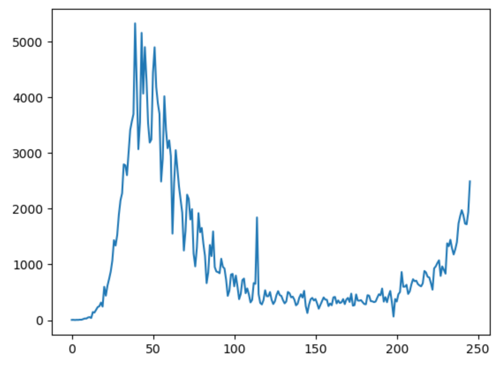
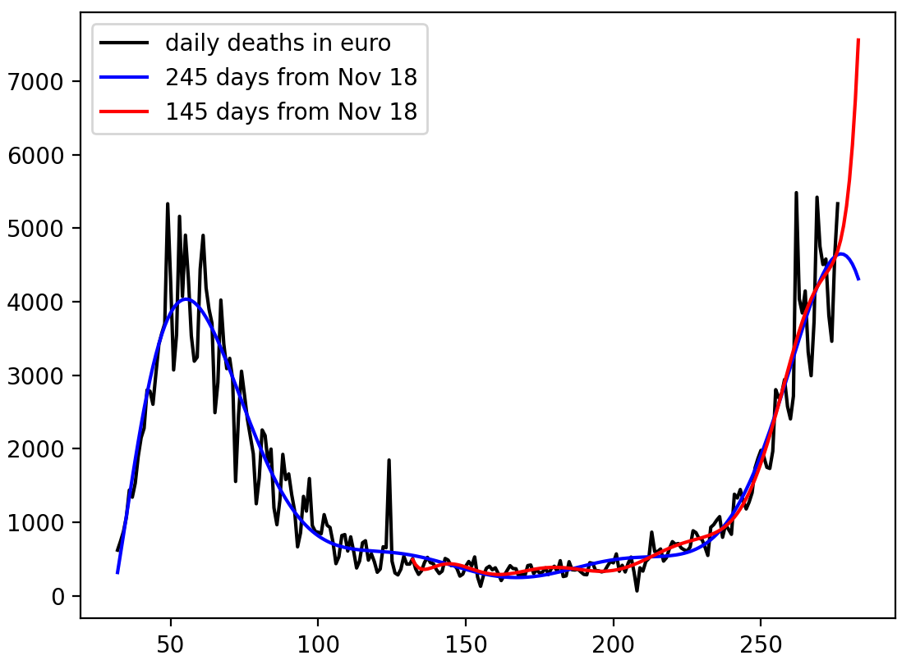

# euro
The resurgence of covid-19 pandemic can be found in Europe.

euro.csv is the number of daily deaths in Europe from Feb.25 to Oct. 23 in 2020.

euro0.png is the number of daily deaths due to covid-19 from Feb.25 to Oct. 23 in 2020.

euro0.py is a program to plot the graph of daily deaths from feb. 25 to Oct. 23 in 2020.

euro.py is a prediction program for fitting the last 120 days as of Oct. 22 in 2020.

For fitting func(a*x*x*x+b*x*x+c*x+d):
a=0.002003539248547459 b=-0.9077447589323873 c=134.36788967707497 d=-6129.516347813743

Based on the fitting func, euro.py can predict the number of deaths on Nov. 23 (30 days) and on dec.23 (60 days) from Oct. 22 in 2020.

If we keep the same policy and attitudes in Europe, 
3410 deaths on Nov. 23 and 6579 deaths on Dec. 23 are expected.

