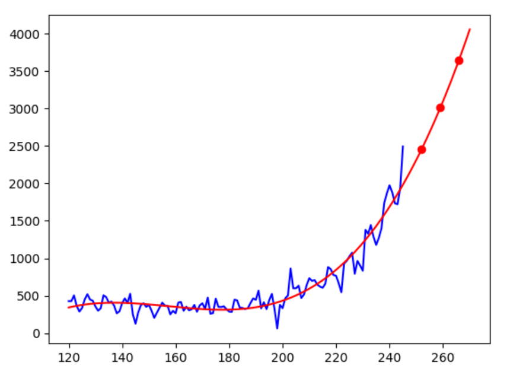

# euro
The resurgence of covid-19 pandemic can be found in Europe.

euro.csv is the number of daily deaths in Europe from Feb.25 to Oct. 23 in 2020.

euro.csv data can be obtained from statista:

https://www.statista.com/statistics/1102288/coronavirus-deaths-development-europe/

euro0.png is the number of daily deaths due to covid-19 from Feb.25 to Oct. 23 in 2020. X-axis indicates the number of the xth day from Feb. 25 and Y-axis is the number of daily deaths in Europe due to the COVID-19.

euro0.py is a program to plot the graph of daily deaths from feb. 25 to Oct. 23 in 2020.
# euro0.py
<pre>
import pandas as pd
import numpy as np
data=pd.read_csv("euro.csv")
y=data["death"]
x=np.arange(0,240)
import matplotlib.pyplot as plt
plt.plot(x,y)
plt.show()
</pre>

euro.py is a prediction program for fitting the last 120 days as of Oct. 22 in 2020.

For fitting func(a*x*x*x+b*x*x+c*x+d):
a=0.002003539248547459 b=-0.9077447589323873 c=134.36788967707497 d=-6129.516347813743

# euro.py
<pre>
import pandas as pd
import numpy as np
data=pd.read_csv("euro.csv")
y=data["death"][120:240]
x=np.arange(120,240)
from scipy.optimize import curve_fit
def func(x,a,b,c,d):
 return a*x*x*x+b*x*x+c*x+d
param=curve_fit(func,x,y)
[a,b,c,d]=param[0]
print(a,b,c,d)
import matplotlib.pyplot as plt
print("Nov. 23 deaths",int(func(270,a,b,c,d)))
print("Dec. 23 deaths",int(func(300,a,b,c,d)))
plt.plot(x,y)
plt.plot(x,func(x,a,b,c,d))
plt.show()
</pre>

# curve_fit using scipy
The objective of curve fitting is to theoretically describe experimental data with a model (function) and to  find the  parameters  associated  with  this  model. The method of least squares determines the coefficients such that the sum of the square of the deviations between the data and the curve-fit is minimized.
<pre>
Algorithm to perform minimization in curve_fit of scipy.optimize library.

  ‘trf’ : Trust Region Reflective algorithm, particularly suitable for large sparse problems with bounds. Generally robust method.
  ‘dogbox’ : dogleg algorithm with rectangular trust regions, typical use case is small problems with bounds. Not recommended for problems with rank-deficient Jacobian.
  ‘lm’ : Levenberg-Marquardt algorithm as implemented in MINPACK. Doesn’t handle bounds and sparse Jacobians. Usually the most efficient method for small unconstrained problems.
Default is ‘trf’. 
</pre>

# practice
You should modify my euro.py program to show the following picture.

Based on the fitting func, euro.py can predict the number of deaths on Nov. 23 (30 days) and that on dec.23 (60 days) from Oct. 22 in 2020 respectively.

# If we keep the same policy and attitudes in Europe, 
# 3410 daily deaths on Nov. 23 and 
# 6579 daily deaths on Dec. 23 in Europe
# are predicted based on the fitting function.

